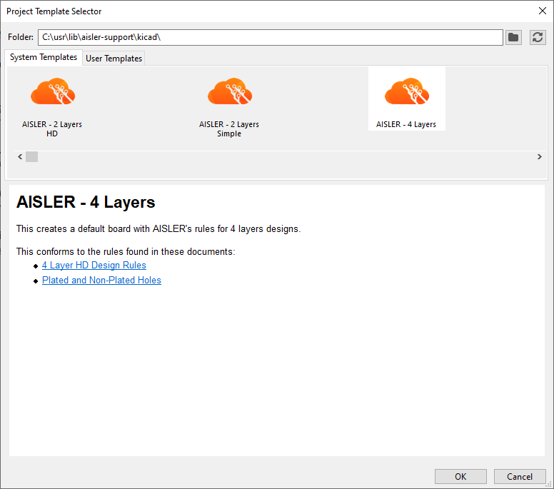

# How to use

Clone this repository so that you can pull updates at any time

```bash
git clone https://github.com/AislerHQ/aisler-support.git
```

When in KiCAD, select from top menu "File/Open New Project from Template...".

Dialog will open, select `kicad` folder from the cloned repo:


Alternatively, you can assign path variable KICAD_USER_TEMPLATE_DIR to the `kicad` directory. Templates will appear then in the "User Templates" tab in the dialog above.